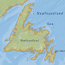

# MyMapApp
ArcGISRuntime for Java Map
Additional required files may be found @ https://1drv.ms/u/s!AsGKD2nEm_nRhRYBN0yn8wq0bMO2
You need to unzip the WIN64 folder and place it directly into the jniLibs folder

